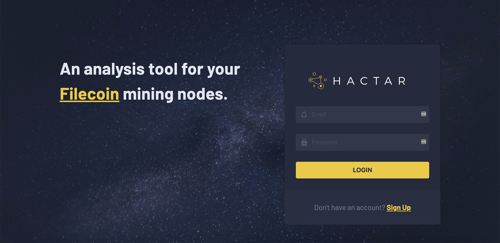
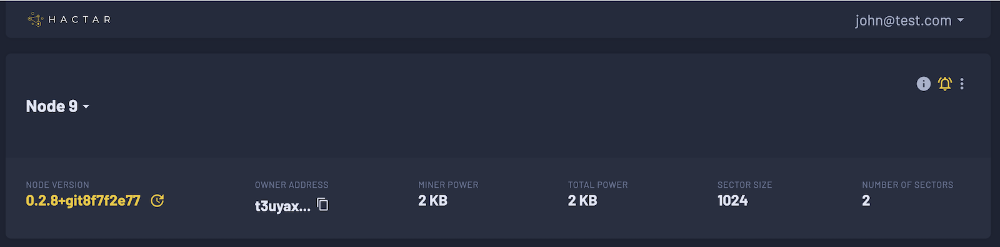
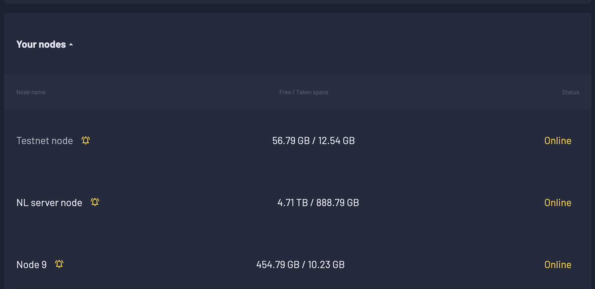
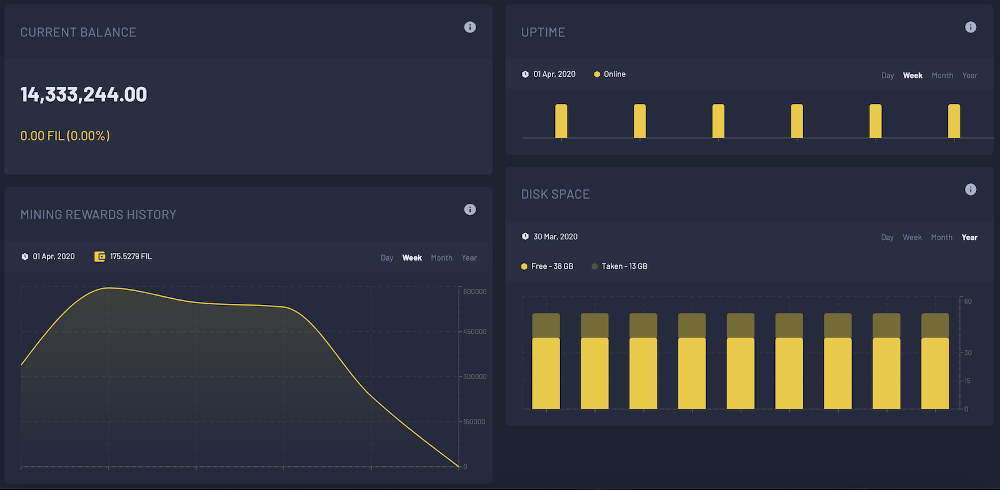
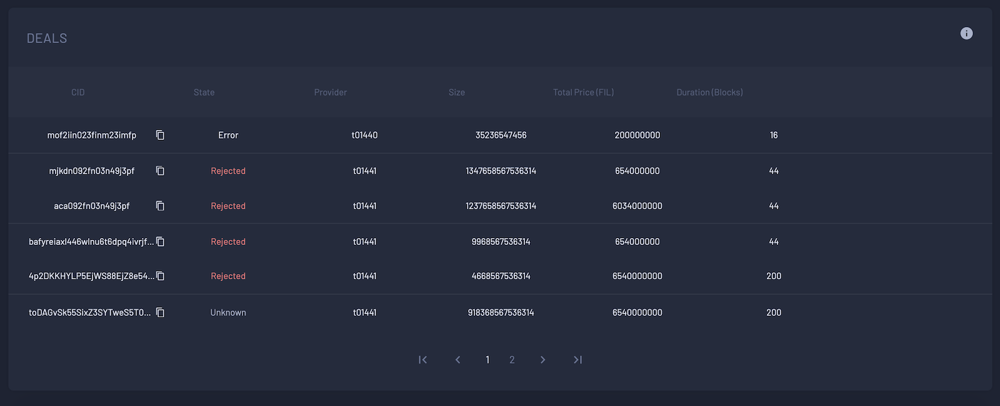

# Hactar
> Analysis and monitoring tool for Filecoin miners.

Hactar is a miner analyzer for [Filecoin](https://filecoin.io/) network.
As miners have the clear incentive to make money on the provided service,
we want to make sure they keep up with it and get the right statistics on their performance,
how much money they are making and how to possibly improve that.
As part of Filecoin’s Wave 1 development grant, [NodeFactory](https://nodefactory.io) built this app.

## Overview 

Hactar architecture consists of:

* Frontend web application (React) - [hactar-frontend repo](https://github.com/NodeFactoryIo/hactar-frontend)
* Backend application (Node.js) - [hactar-backend repo](https://github.com/NodeFactoryIo/hactar-backend)
* Daemon application running along user’s lotus and miner node (Go) - [hactar-daemon repo](https://github.com/NodeFactoryIo/hactar-daemon)

And you can checkout the documentation on [Hactar wiki](https://github.com/NodeFactoryIo/hactar/wiki).

## Screenshots

### Login

### Dashboard - general node info

### Node list

### Dashboard stats

### Monitoring notifications

### Deals

